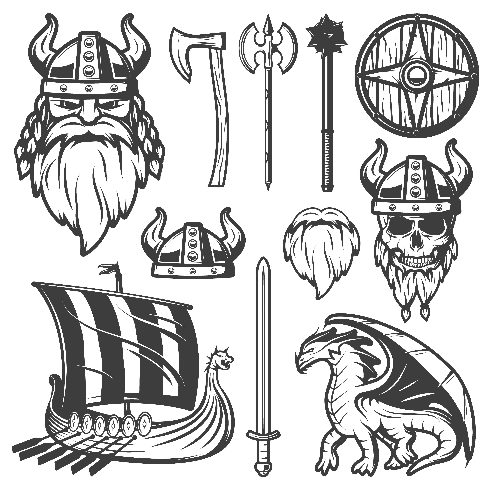

# ¿Podrás entrar la Valhalla, valiente guerrero?: Piedra, Papel o Tijeras, con un giro de tuerca gráfico

## Introducción

El juego es el clasico Piedra, Papel o Tijera, realizado como un ejercicio del curso de programación web con componentes activos, utilizando React.
Pero decidí darle una vuelta y cambiar un poco las cosas...
Entonces realicé las siguientes adaptaciones:

Viejo valor | Nuevo valor
--------|-------
Piedra | Espada
Papel | Escudo
Tijera | Hacha

Donde Espada atraviesa la defensa del Hacha (así como la Piedra destruía las Tijeras), el Hacha parte el Escudo (así como las Tijeras cortaban el Papel), y el Escudo detiene a la Espada (así como el Papel envolvía la Piedra).

En el repositorio se puede encontrar una carpeta llamada "Modulos que no usé" (["click aca"](./src/modulosQueNoUse)) donde pueden verse un intento de trabajo en modularizaciones que no logré implementar.

## Comentarios del trabajo

En un primer momento desarrollé el juego, las reglas y los módulos que quería utilizar, para recién luego agregar la funcionalidad referente a la toma del nombre de usuario y su uso a lo largo del juego mismo. 
Es por esto que en el orden de App.js puede verse primero definido el juego, y recién luego la parte que maneja el nombre del usuario. 

Me resultó bastante complicado la modulariozación inicial y todavía creo que podría cambiarla para hacerla aún más corta y efectiva. Pero todo funciona, que es su tarea principal... 

Utilicé ChtGPT en parte para ir mejorando y corrigiendo codigo, y esa es la razón por la que la mayoría sino todas las variables, props y states estan en ingles en vez de estar en castellano. 

## Fuentes / Credito:

### Font utilizada: 

***"Skranji"***

Copyright (c) 2012, Font Diner (www.fontdiner.com), with Reserved Font Name "Skranji".

This Font Software is licensed under the SIL Open Font License, Version 1.1.
This license is copied below, and is also available with a FAQ at:
http://scripts.sil.org/OFL

### *Imagenes*: 

Obtenidas en http://www.freepik.com - Diseñado para / por macrovector / Freepik. - la imagen original está en la carpeta Assets, img, y se llama CONJUNTO.png. 
Luego se editó lo necesario para utilizarla en el juego.

**Imagen original** 

### SweetAlerts2: 

Utilicé Swal para hacer más vistoso y cómodo algunos sectores del código. Link: https://sweetalert2.github.io/

### Scritps y piezas de codigo. 

S

- Piezas de código corregidos con ChatGPT => http://chat.openai.com

- Información de https://www.w3schools.com/react/default.asp

- CSS con https://lenguajecss.com/css/introduccion/guia-css/

## Testeo y Debug

Queda pendiente mejorar los módulos de opciones y el Popup de bienvenida.
Haber utilizado 

## Agradecimientos: 

- A mis testers: mi esposa, mis viejos, mis primos Diana y Darki y algunos (muchos) amigos que jugaron cientos de partidos del piedra papel tijera buscando errores y dando consejos. 

- Al profesor de las clases prácticas del curso, Nehuen Ragone, por su constante apoyo y claras explicaciones. 

